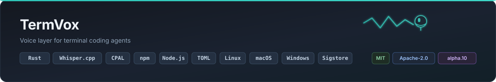

<p align="center">
  
</p>

<h1 align="center">TermVox</h1>

<p align="center">
  <strong>Voice interface for terminal coding agents</strong>
</p>

<p align="center">
  <a href="https://www.npmjs.com/package/termvox"></a>
  <a href="https://github.com/Jeronimo0228/termvox/actions/workflows/ci.yml"></a>
  <a href="LICENSE-MIT"></a>
  <a href="https://www.rust-lang.org/"></a>
</p>

<p align="center">
  
</p>

<p align="center">
  <a href="docs/agents.md"></a>
  <a href="docs/agents.md"></a>
  <a href="docs/agents.md"></a>
  <a href="docs/agents.md"></a>
  <a href="docs/agents.md"></a>
  <a href="docs/agents.md"></a>
  <a href="docs/agents.md"></a>
</p>

<p align="center">
TermVox adds a microphone layer to the coding agents you already run in the terminal.
Speak naturally, review the transcript, and send — with <strong>local Whisper</strong> transcription
and a <strong>confirmation gate</strong> before anything reaches an upstream CLI.
</p>

<p align="center">
  <code>npm install -g termvox && termvox shell</code>
</p>

> **Alpha (`0.1.0-alpha.10`).** APIs, config, and adapters may change between releases.
> Run `termvox doctor` after installing or upgrading upstream agent CLIs.

## How it works

1. **Record** — push-to-talk in `termvox shell`, or hold Space in companion mode.
2. **Transcribe** — Whisper runs locally by default; no speech API key required.
3. **Confirm** — review the prompt; TermVox sends it only when your policy allows.

The integrated **agent shell** keeps the upstream TUI (Cursor, OpenCode, Claude, etc.)
in a PTY with a persistent mic bar — no second terminal, no paste workflow.

## Quick start

**Recommended (npm — full CLI + bootstrap):**

```bash
npm install -g termvox
termvox doctor
termvox shell
termvox-editor-install   # optional Cursor/VS Code extension
```

**Alternative (shell installer):**

```bash
curl -fsSL https://raw.githubusercontent.com/Jeronimo0228/termvox/main/scripts/install.sh | bash
```

Pin a release:

```bash
TERMVOX_VERSION=v0.1.0-alpha.10 curl -fsSL https://raw.githubusercontent.com/Jeronimo0228/termvox/main/scripts/install.sh | bash
```

**From source** — install [Rust 1.88 or later](https://www.rust-lang.org/tools/install), audio
prerequisites, and one supported coding-agent CLI:

```bash
git clone https://github.com/Jeronimo0228/termvox.git
cd termvox

# Fedora/RHEL: sudo dnf install alsa-lib-devel
# Debian/Ubuntu: sudo apt-get install libasound2-dev pkg-config
cargo install --path crates/termvox-cli

termvox init
termvox models install default
termvox doctor
termvox start
```

No speech API key or separate Whisper executable is required. TermVox verifies
and stores the multilingual base model outside the repository; interactive
commands offer this download when it is missing. For remote transcription,
explicitly set `speech_engine = "openai"` and export `OPENAI_API_KEY`.

### Integrated agent shell (recommended for TUIs)

Launch any supported agent CLI with a persistent mic bar — no second terminal,
no paste workflow:

```bash
termvox shell                    # agent from termvox.toml
termvox shell --agent opencode   # OpenCode TUI + voice (F8 / Ctrl+Space)
termvox shell --fresh            # ignore saved workspace session
termvox install-shim --agent claude --force   # Unix: wrap `claude`
```

Workspace sessions are stored in `.termvox/session.json` (gitignored) and reused
when you reopen the same project directory.

While `termvox start` is focused, hold `Space` to record, release it to
transcribe, review the prompt, and answer the confirmation question. Press `q`
or `Ctrl+C` to exit.

## Compatibility at a glance

| Integration | Status in the current source |
| --- | --- |
| Codex, Claude, Cursor, Gemini, Aider, Amp, OpenCode | Built-in CLI adapters |
| `termvox shell` (PTY + mic bar) | All seven built-in agents |
| Embedded Whisper, OpenAI speech-to-text | Built-in speech adapters; Whisper is the free local default |
| Parakeet, Vosk | Generic local sidecar adapters |
| Third-party JSON-RPC plugins | Explicit configuration plus inspect/test lifecycle |

An adapter in source does not guarantee every upstream version works. Run
`termvox doctor` after upgrading a tool — it reports install status and upstream
auth for each agent. See the [compatibility notes](docs/compatibility.md).

## Documentation

- [Quick start](docs/quick-start.md) · [Inicio rápido en español](docs/es/quick-start.md)
- [Agent shell](docs/agent-shell.md) · [Coding agents](docs/agents.md)
- [Installation](docs/installation.md) · [npm install](docs/npm.md) · [npm security](docs/npm-security.md)
- [Speech engines](docs/speech-engines.md)
- [Configuration](docs/configuration.md) · [CLI reference](docs/cli-reference.md)
- [Privacy and security](docs/privacy-security.md)
- [Architecture](docs/architecture.md) · [Plugin protocol](docs/plugin-system.md)
- [Troubleshooting](docs/troubleshooting.md) · [Compatibility](docs/compatibility.md) · [FAQ](docs/faq.md)
- [Demo & launch prep](docs/demo.md) · [Beta checklist](docs/beta-test-checklist.md)
- [Roadmap](docs/roadmap.md) · [Changelog](CHANGELOG.md) · [mdBook navigation](docs/SUMMARY.md)

## Community

Read [CONTRIBUTING.md](CONTRIBUTING.md) before proposing a change. Project
governance, support boundaries, security reporting, maintainers, release
process, and changes are documented in the corresponding repository files.

## License

Licensed under either the [MIT License](LICENSE-MIT) or the
[Apache License 2.0](LICENSE-APACHE), at your option.
